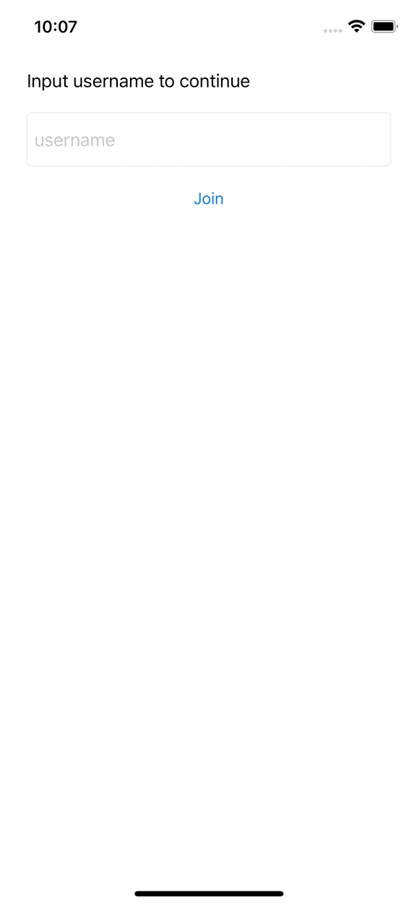

# Agora RTE2021 iOS UIKit Example Project

  

This is the example project shown at [RTE2021](https://rte2021.agora.io) for integrating Agora UIKit into your own iOS application.

## Requirements

- Xcode 12
- iOS 13
- An Agora developer account (see [How to Get Started with Agora](https://www.agora.io/en/blog/how-to-get-started-with-agora?utm_source=github&utm_medium=repo&utm_campaign=RTE2021-UIKit-iOS))

## App Flow

- First the user enters a username.
- The user is shown every other user connected to Agora's Real-time Messaging network.
- On selecting a user a call request is sent.
- Once the other user accepts, the video call screen appears and the call begins.

## App Dependencies

This app utilises the following Swift Packages:

- [AgoraRTM_iOS](https://github.com/AgoraIO/AgoraRTM_iOS)
- [iOS-UIKit](https://github.com/AgoraIO-Community/iOS-UIKit)
  - Sub dependency: [AgoraRtcEngine_iOS](https://github.com/AgoraIO/AgoraRtcEngine_iOS)